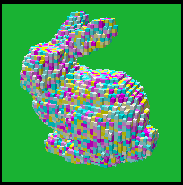
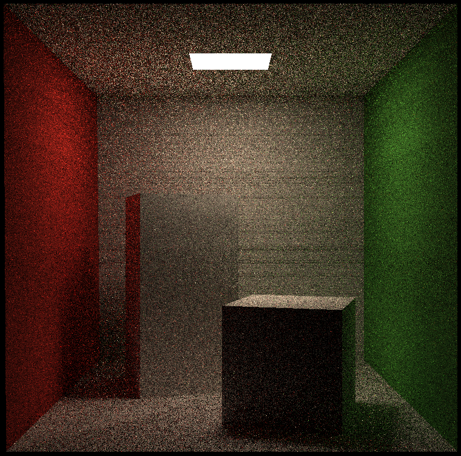
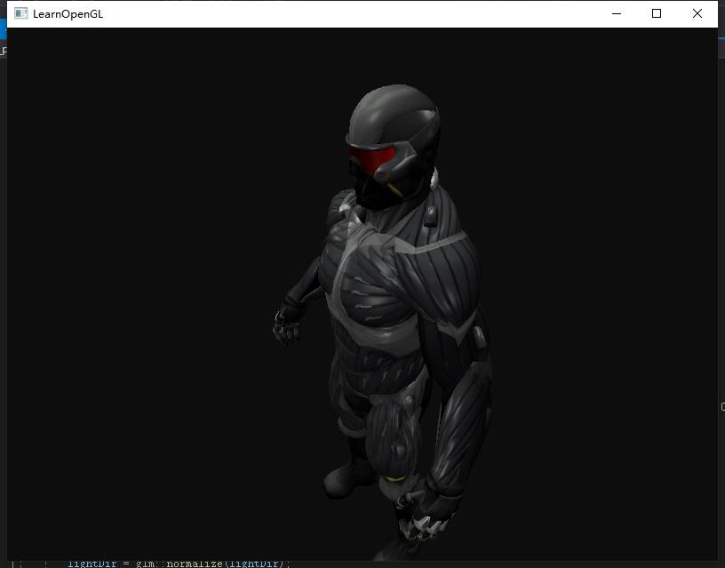
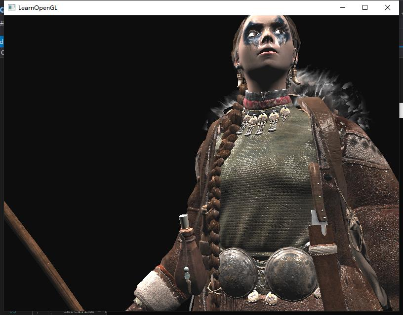

# Yize Chen's Portfolio
Check out more on my [Github](https://github.com/Adam-2000) and
[LinkedIn Profile](https://www.linkedin.com/in/yize-chen-180901207/)  
Email: yic093@ucsd.edu

## **Game Development**
## Space Rover
##### CS 498 Game Development Course Final Project
- 3D game developed with Unreal Engine 4 
- An adventure in the solar system that's about to explode
- Jump into the blackhole

>**Check out** my [demo video](https://www.bilibili.com/video/BV16b4y1B7pc?share_source=copy_web&vd_source=8526efc45b6cabb30a409be5048ff71d) and our [project code](https://github.com/Adam-2000/SpaceRover)
>##### Inspired by [*Outer Wilds*](https://store.steampowered.com/app/753640/Outer_Wilds/)

## Shadow Ninja
##### ECE 385 Digital System Laboratory Final Project
- Side scrolling game developed on FPGA
- Frame buffer graphic output structure developed by me
- 64-color palette

>**Check out** my [demo video](https://www.bilibili.com/video/BV1ap4y1B7Pc?share_source=copy_web&vd_source=8526efc45b6cabb30a409be5048ff71d) and our [project code](https://github.com/Adam-2000/ShadowNinja) 
---
* And this is my another VR educational game [Crystal Vision](https://github.com/Adam-2000/VR_CS397_4_27)
---
 

## **Computer Graphics**
### 3D Rendering pipeline with Haskell

>**Check out** our [project code](https://github.com/TaKeTube/HaScene) 

## Ray Tracer
- Grid Acceleration: 40k triangles bunny rendered in 4 sec by CPU (Reduced from 20 minutes) [[link]](https://github.com/Adam-2000/MIT_6.837/tree/main/Assignment6) 
     
  
- Reflection & Refraction & Shadows & Super-Sampling Anti-Aliasing [[link]](https://github.com/Adam-2000/MIT_6.837/tree/main/Assignment7) 
    
- Curves & Surfaces [[link]](https://github.com/Adam-2000/MIT_6.837/tree/main/Assignment8) 
   
### Global Illumination
- Monte-Carlo Intergration & Russian Roulette & BVH Tree Acceleration [[link]](https://github.com/Adam-2000/Games101/tree/main/Assignment7) 
  

## OpenGL Shader [[link]](https://github.com/Adam-2000/OpenGL-Shader)
- Reflections and Different Texture Mappings  

| | |
|--|--|
| ||
|| |

---
## **Other Exciting Works**
- Operating System - ECE 391 Course Project [[link]](https://github.com/Adam-2000/MP3_ECE391)
- Identification and Tracking of UAVs – Senior Design Project [[link]](https://github.com/zhourrr/Drone-Tracker-optical-sensors-)
- Networks and Distributed System [[link]](https://github.com/Adam-2000/ece438_github)
- GPU Convolution Kernel Optimizations [[link]](https://github.com/Adam-2000/ece408_project)
- Relational Database - CS 225 Course Project [[link]](****)
- Bear Map [[link]](https://github.com/Adam-2000/CS61B_UCBerkeley/tree/main/proj3)
 
 
---
